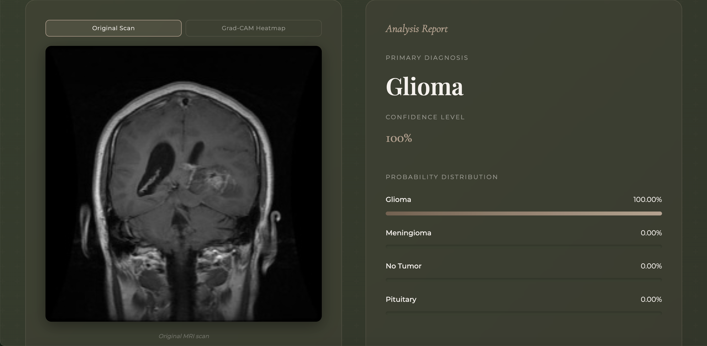
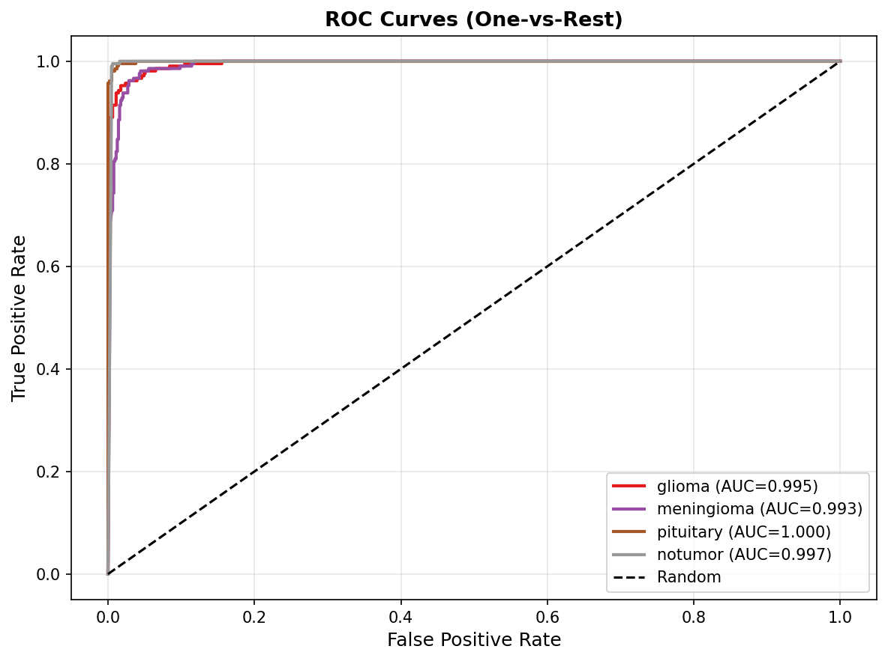

# Brain Tumor MRI Classifier

A deep learning system for multi-class brain tumor classification from MRI scans, achieving **97% accuracy** via transfer learning — with Grad-CAM explainability and an interactive Gradio web interface.

[](https://python.org)
[](https://pytorch.org)
[](LICENSE)
[]()

---

## Overview

This project implements an end-to-end medical image classification pipeline that identifies brain tumors across four categories from MRI scans. The system combines state-of-the-art backbone architectures with visual explainability tools, making predictions both accurate and interpretable.

**Tumor classes:** Glioma · Meningioma · Pituitary Tumor · No Tumor

**Core capabilities:**
- Transfer learning with EfficientNet, ResNet50, and Vision Transformer (ViT) backbones
- Grad-CAM saliency heatmaps to visualize model attention regions
- Clinical-grade evaluation metrics: AUC-ROC, F1, Precision/Recall, Confusion Matrix
- Interactive web demo deployable locally or on HuggingFace Spaces

---

## Results

| Metric | Score |
|---|---|
| Accuracy | **97%** |
| AUC-ROC (Macro) | 0.97 – 0.99 |
| F1 (Weighted) | 0.92 – 0.97 |

---

## Visualizations

### Web Interface



### Grad-CAM Explainability


### Confusion Matrix & ROC Curves



---

## Project Structure

```
tumor_classifier/
│
├── configs/
│   └── config.yaml              # Hyperparameters and settings
│
├── src/
│   ├── data/
│   │   ├── download_data.py     # Dataset download and organization
│   │   └── dataset.py           # PyTorch Dataset and DataLoaders
│   │
│   ├── models/
│   │   └── classifier.py        # Transfer learning model definitions
│   │
│   ├── training/
│   │   └── trainer.py           # Training loop, early stopping, checkpointing
│   │
│   ├── evaluation/
│   │   └── evaluator.py         # Metrics, confusion matrix, ROC curves
│   │
│   └── explainability/
│       └── gradcam.py           # Grad-CAM heatmap generation
│
├── app/
│   └── app.py                   # Gradio web interface
│
├── notebooks/                   # Exploratory data analysis
├── outputs/                     # Checkpoints, metrics, visualizations
├── train.py                     # Main training entry point
└── requirements.txt
```

---

## Setup & Usage

### 1. Clone and Install

```bash
git clone https://github.com/yourusername/tumor-classifier.git
cd tumor-classifier

python -m venv venv
source venv/bin/activate        # Windows: venv\Scripts\activate

pip install -r requirements.txt
```

### 2. Acquire the Dataset

**Option A — Kaggle API (recommended)**

```bash
pip install kaggle
# Place your kaggle.json API token in ~/.kaggle/
python src/data/download_data.py
```

**Option B — Manual download**

1. Download from [Brain Tumor MRI Dataset](https://www.kaggle.com/datasets/masoudnickparvar/brain-tumor-mri-dataset) on Kaggle
2. Unzip into `data/raw/`
3. Run `python src/data/download_data.py` to organize the directory structure

Expected output structure:

```
data/processed/
  train/   glioma/  meningioma/  pituitary/  no_tumor/
  val/     glioma/  meningioma/  pituitary/  no_tumor/
  test/    glioma/  meningioma/  pituitary/  no_tumor/
```

### 3. Configure

Review `configs/config.yaml` before training:

- `data.classes` — confirm class names match folder names
- `training.batch_size` — reduce to `16` if GPU memory is limited
- `model.backbone` — select architecture (see options below)

### 4. Train

```bash
# Default configuration
python train.py

# Override parameters via CLI
python train.py --backbone resnet50 --epochs 30 --batch_size 16

# Vision Transformer (higher accuracy, greater GPU demand)
python train.py --backbone vit_base_patch16_224
```

Training automatically detects available GPU hardware, saves the best checkpoint to `outputs/checkpoints/model_best.pth`, and logs per-epoch metrics.

### 5. Evaluate

Evaluation runs automatically at the end of training. To evaluate a saved checkpoint independently:

```bash
python train.py --eval_only --checkpoint outputs/checkpoints/model_best.pth
```

Outputs written to `outputs/results/`:

| File | Contents |
|---|---|
| `metrics.txt` | Accuracy, F1, AUC-ROC |
| `confusion_matrix.png` | Per-class confusion matrix |
| `roc_curves.png` | Multi-class ROC curves |

### 6. Grad-CAM Explainability

Grad-CAM visualizations are generated automatically during evaluation and saved to `outputs/grad_cam/`. Each output overlays a heatmap on the original MRI scan — red regions indicate the areas that most influenced the model's prediction.

### 7. Web Interface

```bash
python app/app.py
# Navigate to: http://localhost:7860
```

Upload any MRI scan to receive an instant classification with confidence scores and a Grad-CAM heatmap.

---

## Experiment Extensions

The following directions are recommended for further development:

- **Backbone comparison** — Train EfficientNet, ResNet50, and ViT side by side; compare learning curves and inference speed
- **Test-Time Augmentation (TTA)** — Average predictions across multiple augmented views at inference time
- **Model ensembling** — Combine outputs from two or three backbones for improved robustness
- **Tumor segmentation** — Extend to a U-Net architecture to localize tumor boundaries, not just classify type
- **Multi-modal fusion** — Incorporate multiple MRI sequences (T1, T2, FLAIR) for richer feature representation

---

## References

- [Brain Tumor MRI Dataset — Kaggle](https://www.kaggle.com/datasets/masoudnickparvar/brain-tumor-mri-dataset)
- Tan & Le, *EfficientNet: Rethinking Model Scaling for Convolutional Neural Networks*, ICML 2019 — [arXiv:1905.11946](https://arxiv.org/abs/1905.11946)
- Selvaraju et al., *Grad-CAM: Visual Explanations from Deep Networks*, ICCV 2017 — [arXiv:1610.02391](https://arxiv.org/abs/1610.02391)
- [pytorch-image-models (timm)](https://github.com/huggingface/pytorch-image-models)

---

## Disclaimer

This project is intended for educational and research purposes only. It is not validated for clinical use and must not be used for medical diagnosis or treatment decisions. Always consult a qualified medical professional.